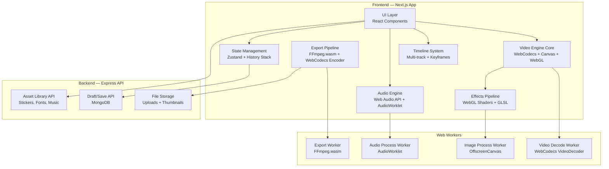

# 🎬 Video Editing Module — Industry-Level Implementation Plan

> **Goal**: Build a complete browser-based video editor inside CreatorCMS that rivals KineMaster/CapCut — supporting trimming, cropping, splitting, multi-track timeline, text overlays, stickers, voiceover, background music, transitions, filters, color grading, speed control, PiP, subtitles, and export — all running client-side with a backend for drafts/saves.

---

## User Review Required

> [!IMPORTANT]
> **This is a ground-up rebuild.** The current `video-editor/page.jsx` (960 lines, template-overlay system) will be **completely replaced** with a modular, multi-file architecture. No existing video editor code will be reused.

> [!WARNING]
> **Browser Compatibility**: WebCodecs and WebGPU are only available in Chromium-based browsers (Chrome, Edge, Brave). Firefox/Safari support is partial. We will implement **graceful fallbacks** (Canvas2D for rendering, FFmpeg.wasm for encoding) but the primary target is **Chrome 94+**.

> [!IMPORTANT]
> **Performance vs Bundle Size Tradeoff**: `ffmpeg.wasm` core is ~25MB. We will lazy-load it only when the user initiates export, and use WebCodecs for real-time preview. This keeps initial page load fast.

---

## Open Questions

> [!IMPORTANT]
> **Q1: Maximum Video Resolution** — Should we cap at 1080p for browser performance, or support 4K editing (significantly heavier on GPU/memory)?

> [!IMPORTANT]
> **Q2: Asset Library** — Should stickers, fonts, and music be bundled locally, or fetched from the backend? If backend, do you want an admin panel to manage these assets?

> [!IMPORTANT]
> **Q3: Cloud Rendering Fallback** — For very long videos (30+ min), browser export may take a while. Should we add a backend FFmpeg rendering queue as a fallback option, or keep everything 100% client-side?

> [!IMPORTANT]
> **Q4: Collaboration** — Any plans for multi-user collaborative editing (like Google Docs for video)? This would significantly change the architecture (WebSocket sync, CRDT, etc.). For now, the plan assumes **single-user editing**.

> [!IMPORTANT]
> **Q5: Mobile Support** — Should the editor be fully functional on mobile/tablet, or desktop-only? Touch-based timeline interaction is complex. Plan currently assumes **desktop-first with basic mobile responsiveness**.

---

## Architecture Overview



---

## Technology Mapping

Every technology you listed is mapped to a specific subsystem:

| Technology | Subsystem | Purpose |
|---|---|---|
| **WebCodecs** | Video Engine | Hardware-accelerated video decode/encode for real-time preview |
| **FFmpeg.wasm** | Export Pipeline | Final video encoding, muxing, format conversion |
| **Media Source Extensions (MSE)** | Video Engine | Streaming decoded frames to `<video>` for smooth playback |
| **HTML5 Video API** | Video Engine | Fallback playback, metadata extraction |
| **Canvas API** | Rendering | Compositing layers (video + text + stickers + effects) |
| **OffscreenCanvas** | Web Workers | Off-thread rendering for thumbnails and export frames |
| **WebGL** | Effects Pipeline | Real-time filters, color grading, transitions, LUT processing |
| **WebGPU** | Effects Pipeline | Modern GPU compute for heavy effects (progressive enhancement) |
| **WebAssembly (WASM)** | Core Processing | FFmpeg core, OpenCV, performance-critical algorithms |
| **Web Audio API** | Audio Engine | Real-time audio playback, mixing, effects (reverb, EQ) |
| **MediaRecorder API** | Audio Engine | Voice-over recording directly in browser |
| **AudioWorklet** | Audio Engine | Custom real-time audio processing (pitch, speed) |
| **Web Workers** | All subsystems | Offload heavy computation from main thread |
| **SharedArrayBuffer** | Worker Communication | Zero-copy data sharing between workers |
| **Web Streams API** | Export Pipeline | Streaming video data during export |
| **requestVideoFrameCallback()** | Video Engine | Frame-accurate sync between video and canvas overlay |
| **ImageBitmap** | Image Processing | Efficient image decoding for stickers and overlays |
| **ImageDecoder API** | Image Processing | Hardware-accelerated image decode (where supported) |
| **MP4Box.js** | Export Pipeline | MP4 container muxing without full FFmpeg |
| **mux.js** | Video Engine | Transmuxing media segments for MSE playback |
| **CSS Animations** | UI Layer | Timeline animations, panel transitions |
| **Web Animations API** | UI Layer | Programmatic keyframe animations for overlays |
| **WebGL Shaders (GLSL)** | Effects Pipeline | Custom filter kernels, color LUTs, blend modes |
| **WebVTT** | Subtitles | Subtitle rendering and export |
| **SRT Parser** | Subtitles | Import/export SRT subtitle files |
| **ASS/SSA Parser** | Subtitles | Advanced styled subtitle support |
| **GLSL Shaders** | Color & Effects | Brightness, contrast, saturation, custom color grading |
| **GPU Compute (WebGPU)** | Color & Effects | Batch pixel processing, advanced compositing |
| **LUT Processing** | Color & Effects | Apply cinematic color lookup tables |
| **OpenCV.js** | AI Features | Background removal, object tracking |
| **ONNX Runtime Web** | AI Features | AI model inference for smart features |
| **TensorFlow.js** | AI Features | Style transfer, super-resolution |
| **MediaPipe** | AI Features | Face/body detection, smart cropping |

---

## Proposed Changes

### Phase 1: Core Engine & State Management

The foundation — video decode pipeline, rendering canvas, and global state.

---

#### [NEW] [video-editor/engine/VideoEngine.js](file:///c:/Users/akont/Desktop/Conenet%20Management%20Project/Content-Management-Web-App/app/(dashboard)/video-editor/engine/VideoEngine.js)

Core video processing engine:
- **WebCodecs VideoDecoder** for hardware-accelerated frame decoding
- **requestVideoFrameCallback()** for frame-accurate canvas sync
- **HTML5 Video API** fallback for browsers without WebCodecs
- Frame buffer management with **ImageBitmap** for zero-copy GPU textures
- Seek-to-frame, get thumbnail at timestamp, extract video metadata
- Manages decode worker communication via **Web Workers**

#### [NEW] [video-editor/engine/VideoDecodeWorker.js](file:///c:/Users/akont/Desktop/Conenet%20Management%20Project/Content-Management-Web-App/app/(dashboard)/video-editor/engine/VideoDecodeWorker.js)

Dedicated Web Worker for video decoding:
- Runs **WebCodecs VideoDecoder** off-main-thread
- Uses **SharedArrayBuffer** for frame data transfer to main thread
- Demuxes MP4 containers using **MP4Box.js**
- Handles seek operations without blocking UI

#### [NEW] [video-editor/engine/CanvasRenderer.js](file:///c:/Users/akont/Desktop/Conenet%20Management%20Project/Content-Management-Web-App/app/(dashboard)/video-editor/engine/CanvasRenderer.js)

Multi-layer compositing renderer:
- **Canvas API (2D)** for layer compositing (video base + overlays + text + stickers)
- Render loop synced to **requestVideoFrameCallback()** for frame-accurate preview
- Layer z-ordering, blending modes, opacity
- Handles resolution scaling for performance (preview at lower res, export at full)
- Manages dirty-rect optimization (only re-render changed regions)

#### [NEW] [video-editor/store/editorStore.js](file:///c:/Users/akont/Desktop/Conenet%20Management%20Project/Content-Management-Web-App/app/(dashboard)/video-editor/store/editorStore.js)

Global state management using **Zustand**:
- Project state: tracks, clips, effects, text layers, audio layers
- Playback state: currentTime, isPlaying, playbackRate
- UI state: selectedTrack, selectedClip, activePanel, zoom level
- **Undo/Redo history stack** (command pattern with 50-step history)
- Auto-save debounced to IndexedDB every 30 seconds
- Serialization/deserialization for draft save/load

#### [NEW] [video-editor/store/historyManager.js](file:///c:/Users/akont/Desktop/Conenet%20Management%20Project/Content-Management-Web-App/app/(dashboard)/video-editor/store/historyManager.js)

Undo/Redo system:
- Command pattern: each edit creates a reversible command object
- Stack-based history with configurable depth (50 steps default)
- Grouped operations (e.g., drag-move records as single undo step)
- Integrates with Zustand store via middleware

---

### Phase 2: Timeline System

The multi-track NLE (Non-Linear Editor) timeline — the core interaction surface.

---

#### [NEW] [video-editor/timeline/Timeline.jsx](file:///c:/Users/akont/Desktop/Conenet%20Management%20Project/Content-Management-Web-App/app/(dashboard)/video-editor/timeline/Timeline.jsx)

Main timeline component:
- **Multi-track layout**: Video tracks, Audio tracks, Text tracks, Sticker tracks
- Horizontal scroll with zoom (0.1x to 10x) via mouse wheel + pinch
- Time ruler with frame-accurate tick marks
- Vertical track stacking with drag-to-reorder
- Playhead scrubbing with real-time preview update
- Magnetic snapping (clip edges snap to playhead, other clip edges, markers)
- Keyboard shortcuts (J/K/L for playback, I/O for in/out points, Space for play/pause)

#### [NEW] [video-editor/timeline/Track.jsx](file:///c:/Users/akont/Desktop/Conenet%20Management%20Project/Content-Management-Web-App/app/(dashboard)/video-editor/timeline/Track.jsx)

Individual track component:
- Track types: `video`, `audio`, `text`, `sticker`, `effect`
- Mute/Solo/Lock controls per track
- Track height resize
- Clip rendering within track bounds

#### [NEW] [video-editor/timeline/Clip.jsx](file:///c:/Users/akont/Desktop/Conenet%20Management%20Project/Content-Management-Web-App/app/(dashboard)/video-editor/timeline/Clip.jsx)

Individual clip on a track:
- Drag to move (within track and between tracks)
- Resize handles on left/right edges for trimming
- Waveform visualization for audio clips (via **Web Audio API** `AnalyserNode`)
- Thumbnail strip for video clips (generated via **OffscreenCanvas** worker)
- Right-click context menu (Split, Delete, Duplicate, Speed, etc.)
- Visual indicators for applied effects/transitions

#### [NEW] [video-editor/timeline/TimeRuler.jsx](file:///c:/Users/akont/Desktop/Conenet%20Management%20Project/Content-Management-Web-App/app/(dashboard)/video-editor/timeline/TimeRuler.jsx)

Time ruler and playhead:
- Frame-accurate time display (HH:MM:SS:FF)
- Click-to-seek on ruler
- Draggable playhead with real-time preview
- Zoom-responsive tick intervals
- In/Out point markers for range selection

#### [NEW] [video-editor/timeline/useTimelineInteractions.js](file:///c:/Users/akont/Desktop/Conenet%20Management%20Project/Content-Management-Web-App/app/(dashboard)/video-editor/timeline/useTimelineInteractions.js)

Custom hook for timeline interactions:
- Drag-and-drop clip management
- Ripple/insert/overwrite edit modes
- Split at playhead
- Magnetic snapping logic
- Keyboard shortcut handler
- Scroll/zoom synchronization

---

### Phase 3: Video Operations (Trim, Crop, Split, Speed)

Core video manipulation features.

---

#### [NEW] [video-editor/operations/TrimOperation.js](file:///c:/Users/akont/Desktop/Conenet%20Management%20Project/Content-Management-Web-App/app/(dashboard)/video-editor/operations/TrimOperation.js)

Video trimming:
- Set in-point and out-point on any clip
- Non-destructive trim (original media preserved, only playback range changes)
- Frame-accurate trim points using **WebCodecs** frame indexing
- Visual trim handles on timeline clips

#### [NEW] [video-editor/operations/CropOperation.js](file:///c:/Users/akont/Desktop/Conenet%20Management%20Project/Content-Management-Web-App/app/(dashboard)/video-editor/operations/CropOperation.js)

Video cropping:
- Interactive crop rectangle overlay on preview canvas
- Preset aspect ratios (16:9, 9:16, 1:1, 4:5, 4:3)
- Free-form crop with drag handles
- Per-clip crop applied via **Canvas API** `drawImage()` source rectangle
- Animated crop transitions (Ken Burns effect)

#### [NEW] [video-editor/operations/SplitOperation.js](file:///c:/Users/akont/Desktop/Conenet%20Management%20Project/Content-Management-Web-App/app/(dashboard)/video-editor/operations/SplitOperation.js)

Split/Cut:
- Split clip at current playhead position
- Creates two independent clips from single source
- Maintains all effects/properties on both resulting clips
- Blade tool mode for continuous splitting

#### [NEW] [video-editor/operations/SpeedOperation.js](file:///c:/Users/akont/Desktop/Conenet%20Management%20Project/Content-Management-Web-App/app/(dashboard)/video-editor/operations/SpeedOperation.js)

Speed control:
- Playback speed: 0.1x to 10x
- Smooth slow-motion with frame interpolation (via **WebGL** optical flow shader)
- Speed ramping with bezier curve editor (like CapCut's velocity curves)
- Reverse playback
- Freeze frame

#### [NEW] [video-editor/operations/TransformOperation.js](file:///c:/Users/akont/Desktop/Conenet%20Management%20Project/Content-Management-Web-App/app/(dashboard)/video-editor/operations/TransformOperation.js)

Transform controls:
- Position (X, Y) with drag on canvas
- Scale with handles
- Rotation with rotation handle
- Flip horizontal/vertical
- Keyframeable transforms for animation
- Picture-in-Picture (PiP) mode

---

### Phase 4: Text & Typography System

Full-featured text overlay system.

---

#### [NEW] [video-editor/text/TextEngine.js](file:///c:/Users/akont/Desktop/Conenet%20Management%20Project/Content-Management-Web-App/app/(dashboard)/video-editor/text/TextEngine.js)

Text rendering engine:
- Rich text rendering on **Canvas API** with full style control
- Google Fonts integration (dynamic font loading via Font Face API)
- Text animations: typewriter, fade-in word-by-word, bounce, slide, glitch
- Text along path (curved text via Canvas `measureText` + bezier path)
- Text stroke, shadow, gradient fill
- Auto-sizing text boxes
- Emoji support with proper rendering

#### [NEW] [video-editor/text/TextPanel.jsx](file:///c:/Users/akont/Desktop/Conenet%20Management%20Project/Content-Management-Web-App/app/(dashboard)/video-editor/text/TextPanel.jsx)

Text editing UI panel:
- Font family picker (categorized: Sans, Serif, Display, Handwriting)
- Font size, weight, style (bold, italic, underline)
- Text color with gradient support
- Text alignment and line spacing
- Character spacing (tracking/kerning)
- Text animation preset selector
- Per-character color/style (rich text)
- Text template presets (Title, Lower Third, Caption, etc.)

#### [NEW] [video-editor/text/TextOverlay.jsx](file:///c:/Users/akont/Desktop/Conenet%20Management%20Project/Content-Management-Web-App/app/(dashboard)/video-editor/text/TextOverlay.jsx)

Interactive text layer on canvas:
- Drag to position
- Resize with aspect-lock handles
- Double-click to edit text inline
- Rotation handle
- Bounding box with style preview

---

### Phase 5: Stickers, Images & Overlays

Media overlay system for stickers, images, and decorative elements.

---

#### [NEW] [video-editor/overlays/StickerEngine.js](file:///c:/Users/akont/Desktop/Conenet%20Management%20Project/Content-Management-Web-App/app/(dashboard)/video-editor/overlays/StickerEngine.js)

Sticker system:
- **ImageBitmap** for efficient GPU-ready sticker rendering
- **ImageDecoder API** for hardware-accelerated decode (progressive enhancement)
- Animated sticker support (GIF, APNG, Lottie JSON)
- Sticker categories: Emoji, Shapes, Arrows, Social Media, Custom Upload
- Drag-and-drop from panel to canvas
- Keyframeable position, scale, rotation, opacity

#### [NEW] [video-editor/overlays/StickerPanel.jsx](file:///c:/Users/akont/Desktop/Conenet%20Management%20Project/Content-Management-Web-App/app/(dashboard)/video-editor/overlays/StickerPanel.jsx)

Sticker browser UI:
- Searchable sticker library
- Category tabs (Popular, Emoji, Shapes, Animated, Custom)
- Upload custom sticker/image
- Preview on hover
- Drag to timeline or canvas to add

#### [NEW] [video-editor/overlays/OverlayLayer.jsx](file:///c:/Users/akont/Desktop/Conenet%20Management%20Project/Content-Management-Web-App/app/(dashboard)/video-editor/overlays/OverlayLayer.jsx)

Generic overlay layer component:
- Shared interactive layer for stickers, images, and PiP video
- Transform gizmo (move, scale, rotate handles)
- Opacity slider
- Blend mode selector (Normal, Multiply, Screen, Overlay, etc.)
- Duration control on timeline

---

### Phase 6: Audio System

Complete audio editing with mixing, voiceover, and background music.

---

#### [NEW] [video-editor/audio/AudioEngine.js](file:///c:/Users/akont/Desktop/Conenet%20Management%20Project/Content-Management-Web-App/app/(dashboard)/video-editor/audio/AudioEngine.js)

Core audio engine built on **Web Audio API**:
- `AudioContext` graph: source → gain → effects → analyser → destination
- Multi-track audio mixing (original video audio + music + voiceover + SFX)
- Per-track volume, pan, mute/solo
- Audio ducking (auto-lower music when voiceover is active)
- Crossfade between audio clips
- Real-time waveform via `AnalyserNode`
- Audio scrubbing during timeline seek

#### [NEW] [video-editor/audio/AudioWorkletProcessor.js](file:///c:/Users/akont/Desktop/Conenet%20Management%20Project/Content-Management-Web-App/app/(dashboard)/video-editor/audio/AudioWorkletProcessor.js)

Custom **AudioWorklet** processor:
- Real-time pitch shift without speed change (for voice effects)
- Audio speed change without pitch shift (time-stretch)
- Custom audio effects: reverb, echo, EQ, noise reduction
- Low-latency processing on dedicated audio thread

#### [NEW] [video-editor/audio/VoiceoverRecorder.jsx](file:///c:/Users/akont/Desktop/Conenet%20Management%20Project/Content-Management-Web-App/app/(dashboard)/video-editor/audio/VoiceoverRecorder.jsx)

Voice-over recording panel using **MediaRecorder API**:
- Record from microphone with live waveform preview
- Countdown timer before recording starts
- Record while video plays (synced to timeline position)
- Noise gate / basic noise reduction
- Re-record and trim recordings
- Auto-place recorded audio on voiceover track

#### [NEW] [video-editor/audio/MusicPanel.jsx](file:///c:/Users/akont/Desktop/Conenet%20Management%20Project/Content-Management-Web-App/app/(dashboard)/video-editor/audio/MusicPanel.jsx)

Background music panel:
- Built-in royalty-free music library (categorized by mood/genre)
- Upload custom audio files (MP3, WAV, AAC, OGG)
- Preview with play button
- Beat detection for auto-sync (via **Web Audio API** `AnalyserNode` FFT)
- Drag to audio track on timeline
- Auto-fit music to video duration (loop/trim)

#### [NEW] [video-editor/audio/AudioPanel.jsx](file:///c:/Users/akont/Desktop/Conenet%20Management%20Project/Content-Management-Web-App/app/(dashboard)/video-editor/audio/AudioPanel.jsx)

Audio controls panel:
- Volume slider per track
- Audio fade in/out curves
- Audio effects: Voice Changer, Echo, Reverb, Bass Boost
- Sound effects library (whoosh, pop, ding, etc.)
- Waveform visualization per clip

---

### Phase 7: Effects, Filters & Color Grading

Visual effects pipeline powered by WebGL/WebGPU.

---

#### [NEW] [video-editor/effects/EffectsPipeline.js](file:///c:/Users/akont/Desktop/Conenet%20Management%20Project/Content-Management-Web-App/app/(dashboard)/video-editor/effects/EffectsPipeline.js)

WebGL-based effects rendering pipeline:
- **WebGL 2.0** shader pipeline with fallback to WebGL 1.0
- **WebGPU** compute pipeline for modern browsers (progressive enhancement)
- Effect chain: each effect is a shader pass (ping-pong framebuffers)
- Built-in effects:
  - **Brightness / Contrast / Saturation / Hue / Temperature**
  - **Blur (Gaussian, Radial, Motion)**
  - **Sharpen / Noise / Grain**
  - **Vignette / Chromatic Aberration**
  - **Glitch / RGB Split / Pixelate**
  - **Bloom / Glow**
- Custom **GLSL** shader injection for advanced users

#### [NEW] [video-editor/effects/shaders/](file:///c:/Users/akont/Desktop/Conenet%20Management%20Project/Content-Management-Web-App/app/(dashboard)/video-editor/effects/shaders/)

Directory of GLSL shader files:
- `colorCorrection.glsl` — Brightness, contrast, saturation, exposure, highlights, shadows
- `blur.glsl` — Gaussian, radial, and motion blur kernels
- `lut.glsl` — **LUT Processing** for cinematic color grading (load 3D LUT textures)
- `transition.glsl` — Dissolve, wipe, zoom, slide, glitch transition shaders
- `chromaKey.glsl` — Green screen removal shader
- `vignette.glsl` — Customizable vignette effect
- `glitch.glsl` — Digital glitch, scan lines, RGB split

#### [NEW] [video-editor/effects/ColorGrading.jsx](file:///c:/Users/akont/Desktop/Conenet%20Management%20Project/Content-Management-Web-App/app/(dashboard)/video-editor/effects/ColorGrading.jsx)

Color grading panel:
- Color wheels (Lift / Gamma / Gain — 3-way color corrector)
- HSL adjustment per color channel
- Curves (RGB curves editor like Photoshop)
- **LUT file** import (.cube, .3dl formats)
- Built-in LUT presets (Cinematic, Vintage, B&W, Warm, Cool, etc.)
- Before/After split-view comparison
- Histogram display

#### [NEW] [video-editor/effects/FiltersPanel.jsx](file:///c:/Users/akont/Desktop/Conenet%20Management%20Project/Content-Management-Web-App/app/(dashboard)/video-editor/effects/FiltersPanel.jsx)

Instagram-style filter presets:
- 30+ preset filters (each a combination of GLSL shader parameters)
- Filter intensity slider (0% to 100%)
- Thumbnail preview of each filter on current frame
- Categories: Portrait, Landscape, Food, Vintage, Cinematic, B&W

#### [NEW] [video-editor/effects/TransitionsPanel.jsx](file:///c:/Users/akont/Desktop/Conenet%20Management%20Project/Content-Management-Web-App/app/(dashboard)/video-editor/effects/TransitionsPanel.jsx)

Transition effects between clips:
- Transitions: Dissolve, Fade, Wipe (L/R/U/D), Zoom, Slide, Glitch, Spin
- Duration control (0.1s to 3s)
- Drag transition to junction between two clips on timeline
- Preview animation thumbnail
- Custom easing curves

---

### Phase 8: Subtitles & Captions

Full subtitle editing system.

---

#### [NEW] [video-editor/subtitles/SubtitleEngine.js](file:///c:/Users/akont/Desktop/Conenet%20Management%20Project/Content-Management-Web-App/app/(dashboard)/video-editor/subtitles/SubtitleEngine.js)

Subtitle processing:
- **WebVTT** parser and renderer (native browser format)
- **SRT** parser/exporter
- **ASS/SSA** parser for styled subtitles
- Subtitle timing sync with timeline
- Word-by-word highlight animation (karaoke style, like CapCut)
- Auto-position based on safe zones
- Export subtitles as burned-in (hardcoded into video) or as separate file

#### [NEW] [video-editor/subtitles/SubtitlePanel.jsx](file:///c:/Users/akont/Desktop/Conenet%20Management%20Project/Content-Management-Web-App/app/(dashboard)/video-editor/subtitles/SubtitlePanel.jsx)

Subtitle editing UI:
- Add subtitle cue at current time
- Edit text, start time, end time per cue
- Import SRT/VTT/ASS file
- Subtitle style editor (font, color, background, position)
- Auto-scroll to active subtitle during playback
- Bulk timing shift

---

### Phase 9: Export Pipeline

The final render and export system.

---

#### [NEW] [video-editor/export/ExportEngine.js](file:///c:/Users/akont/Desktop/Conenet%20Management%20Project/Content-Management-Web-App/app/(dashboard)/video-editor/export/ExportEngine.js)

Export orchestrator:
- **Primary path**: **WebCodecs VideoEncoder** + **MP4Box.js** for MP4 muxing
- **Fallback path**: **FFmpeg.wasm** for full encoding (supports more formats)
- Frame-by-frame rendering through the effects pipeline via **OffscreenCanvas** in a **Web Worker**
- Audio mixdown via offline **Web Audio API** `OfflineAudioContext`
- Progress reporting with estimated time remaining
- **Web Streams API** for streaming encoded data to disk (avoids memory overflow on large files)
- Resolution options: 480p, 720p, 1080p, 4K
- Format options: MP4 (H.264), WebM (VP9), MOV
- Quality presets: Draft (fast), Standard, High Quality

#### [NEW] [video-editor/export/ExportWorker.js](file:///c:/Users/akont/Desktop/Conenet%20Management%20Project/Content-Management-Web-App/app/(dashboard)/video-editor/export/ExportWorker.js)

Dedicated Web Worker for export:
- Loads **ffmpeg.wasm** core on-demand (lazy load, ~25MB)
- Receives rendered frames from main thread via **SharedArrayBuffer**
- Encodes video + mixes audio into final output container
- Streams output back to main thread for download
- Handles export cancellation cleanly

#### [NEW] [video-editor/export/ExportPanel.jsx](file:///c:/Users/akont/Desktop/Conenet%20Management%20Project/Content-Management-Web-App/app/(dashboard)/video-editor/export/ExportPanel.jsx)

Export dialog UI:
- Resolution selector with file size estimates
- Format/codec selector
- Quality slider
- Platform presets (YouTube, Instagram Reels, TikTok, Twitter)
- Progress bar with preview of current encoding frame
- Cancel export button
- Auto-download on completion
- Option to save to Media Library (backend upload)

---

### Phase 10: AI Features (Optional / Progressive Enhancement)

AI-powered smart editing features.

---

#### [NEW] [video-editor/ai/BackgroundRemover.js](file:///c:/Users/akont/Desktop/Conenet%20Management%20Project/Content-Management-Web-App/app/(dashboard)/video-editor/ai/BackgroundRemover.js)

AI background removal:
- **MediaPipe** Selfie Segmentation for real-time person segmentation
- **ONNX Runtime Web** for running custom segmentation models
- Green screen keying via **GLSL chromaKey shader** (non-AI alternative)
- Replace background with solid color, image, or video

#### [NEW] [video-editor/ai/AutoCaptions.js](file:///c:/Users/akont/Desktop/Conenet%20Management%20Project/Content-Management-Web-App/app/(dashboard)/video-editor/ai/AutoCaptions.js)

Auto-generate captions from speech:
- **Web Speech API** for browser-native speech recognition
- Or send audio to backend Whisper API for higher accuracy
- Auto-generate timed subtitle cues
- User can review and edit auto-generated captions

#### [NEW] [video-editor/ai/SmartCrop.js](file:///c:/Users/akont/Desktop/Conenet%20Management%20Project/Content-Management-Web-App/app/(dashboard)/video-editor/ai/SmartCrop.js)

AI smart reframing:
- **MediaPipe** Face Detection to track subjects
- Auto-crop landscape video to portrait (16:9 → 9:16) following face position
- **TensorFlow.js** for object detection based framing

#### [NEW] [video-editor/ai/StyleTransfer.js](file:///c:/Users/akont/Desktop/Conenet%20Management%20Project/Content-Management-Web-App/app/(dashboard)/video-editor/ai/StyleTransfer.js)

AI style transfer effects:
- **TensorFlow.js** neural style transfer models
- Apply artistic styles to video frames in real-time
- Cartoon, Oil Painting, Sketch, Anime effects

---

### Phase 11: Draft/Save System & Backend

Persistence layer for saving projects, drafts, and assets.

---

#### [NEW] [video-editor/store/projectSerializer.js](file:///c:/Users/akont/Desktop/Conenet%20Management%20Project/Content-Management-Web-App/app/(dashboard)/video-editor/store/projectSerializer.js)

Project file format:
- Serialize entire editor state to JSON (tracks, clips, effects, text, timing)
- Media files stored as references (blob URLs → IndexedDB keys)
- Version-stamped project format for forward compatibility
- Compress project data before save (LZ-string)

#### [NEW] [video-editor/store/localDraftManager.js](file:///c:/Users/akont/Desktop/Conenet%20Management%20Project/Content-Management-Web-App/app/(dashboard)/video-editor/store/localDraftManager.js)

IndexedDB-based local draft system:
- Auto-save project every 30 seconds
- Store media files (video, audio, images) in IndexedDB
- Draft list with thumbnails and last-modified timestamps
- Draft recovery on browser crash (restore from last auto-save)
- Storage quota management (warn when approaching limits)

#### [MODIFY] [video-editor/page.jsx](file:///c:/Users/akont/Desktop/Conenet%20Management%20Project/Content-Management-Web-App/app/(dashboard)/video-editor/page.jsx)

**Complete rewrite** — becomes a thin shell that assembles all modules:
- Imports and orchestrates: VideoEngine, Timeline, Panels, Export
- Layout: Preview Canvas (left) | Tool Panels (right) | Timeline (bottom)
- Panel switching: Media, Text, Stickers, Audio, Effects, Subtitles, Export
- Keyboard shortcut registration
- Responsive layout for different screen sizes

#### [DELETE] [video-editor/templates.js](file:///c:/Users/akont/Desktop/Conenet%20Management%20Project/Content-Management-Web-App/app/(dashboard)/video-editor/templates.js)

No longer needed — replaced by the modular text/sticker/overlay system.

---

#### Backend API — Video Editor Module

#### [NEW] [src/modules/video-editor/video-editor.model.ts](file:///c:/Users/akont/Desktop/Conenet%20Management%20Project/Content-Management-Backend/src/modules/video-editor/video-editor.model.ts)

MongoDB schema for video editor projects:
```typescript
{
  userId: ObjectId,
  projectName: string,
  status: 'draft' | 'saved' | 'exported',
  projectData: {           // Serialized editor state JSON
    version: string,
    tracks: Track[],
    clips: Clip[],
    effects: Effect[],
    duration: number,
    resolution: { width, height },
    fps: number
  },
  thumbnail: string,       // Base64 or URL to preview image
  mediaAssets: [{          // References to uploaded media files
    assetId: string,
    type: 'video' | 'audio' | 'image',
    filename: string,
    filesize: number,
    storageKey: string     // Path in uploads/
  }],
  exportHistory: [{
    exportedAt: Date,
    format: string,
    resolution: string,
    filesize: number
  }],
  createdAt: Date,
  updatedAt: Date,
  lastAutoSave: Date
}
```

#### [NEW] [src/modules/video-editor/video-editor.controller.ts](file:///c:/Users/akont/Desktop/Conenet%20Management%20Project/Content-Management-Backend/src/modules/video-editor/video-editor.controller.ts)

REST API endpoints:
- `POST /api/video-editor/projects` — Create new project
- `GET /api/video-editor/projects` — List user's projects (with thumbnails)
- `GET /api/video-editor/projects/:id` — Get project details + data
- `PUT /api/video-editor/projects/:id` — Save/update project
- `PUT /api/video-editor/projects/:id/auto-save` — Auto-save draft (debounced)
- `DELETE /api/video-editor/projects/:id` — Delete project
- `POST /api/video-editor/projects/:id/duplicate` — Duplicate project
- `POST /api/video-editor/assets/upload` — Upload media asset (multer)
- `GET /api/video-editor/assets/library` — Get sticker/music/font library
- `POST /api/video-editor/projects/:id/export` — Log export event

#### [NEW] [src/modules/video-editor/video-editor.service.ts](file:///c:/Users/akont/Desktop/Conenet%20Management%20Project/Content-Management-Backend/src/modules/video-editor/video-editor.service.ts)

Business logic:
- Project CRUD with user ownership validation
- Auto-save with conflict resolution (latest timestamp wins)
- Media asset management (link assets to projects, cleanup orphans)
- Storage quota enforcement per user
- Thumbnail generation on save (from project data)

#### [NEW] [src/modules/video-editor/video-editor.routes.ts](file:///c:/Users/akont/Desktop/Conenet%20Management%20Project/Content-Management-Backend/src/modules/video-editor/video-editor.routes.ts)

Express router for video editor API endpoints.

---

### Phase 12: Main Page & UI Components

The main editor page and all panel/toolbar components.

---

#### [NEW] [video-editor/components/Toolbar.jsx](file:///c:/Users/akont/Desktop/Conenet%20Management%20Project/Content-Management-Web-App/app/(dashboard)/video-editor/components/Toolbar.jsx)

Top toolbar:
- Undo / Redo buttons (with shortcut indicators)
- Tool selector: Select, Crop, Text, Blade (split)
- Zoom controls
- Project name (editable)
- Save / Auto-save indicator
- Export button

#### [NEW] [video-editor/components/PreviewCanvas.jsx](file:///c:/Users/akont/Desktop/Conenet%20Management%20Project/Content-Management-Web-App/app/(dashboard)/video-editor/components/PreviewCanvas.jsx)

Main video preview area:
- Canvas element for composited preview
- Overlay interaction layer (drag text, stickers, crop handles)
- Safe zone guidelines (toggle)
- Canvas resolution indicator
- Fit/Fill/Actual size view modes
- Full-screen preview mode

#### [NEW] [video-editor/components/PanelSwitcher.jsx](file:///c:/Users/akont/Desktop/Conenet%20Management%20Project/Content-Management-Web-App/app/(dashboard)/video-editor/components/PanelSwitcher.jsx)

Right-side panel controller:
- Tab icons: Media, Text, Stickers, Audio, Effects, Subtitles, Export
- Animated panel transitions
- Collapsible panel for more canvas space

#### [NEW] [video-editor/components/MediaPanel.jsx](file:///c:/Users/akont/Desktop/Conenet%20Management%20Project/Content-Management-Web-App/app/(dashboard)/video-editor/components/MediaPanel.jsx)

Media import panel:
- Upload video/image/audio files
- Drag & drop zone
- Recently used media
- Media library integration (from backend)
- Media preview with metadata (duration, resolution, size)

#### [NEW] [video-editor/components/PropertiesPanel.jsx](file:///c:/Users/akont/Desktop/Conenet%20Management%20Project/Content-Management-Web-App/app/(dashboard)/video-editor/components/PropertiesPanel.jsx)

Context-sensitive properties panel:
- Shows properties of selected clip/layer
- Transform controls (position, scale, rotation)
- Opacity slider
- Blend mode selector
- Effect stack (add/remove/reorder effects)
- Keyframe editor for animated properties

#### [NEW] [video-editor/components/KeyframeEditor.jsx](file:///c:/Users/akont/Desktop/Conenet%20Management%20Project/Content-Management-Web-App/app/(dashboard)/video-editor/components/KeyframeEditor.jsx)

Keyframe animation editor:
- Diamond keyframe markers on clip in timeline
- Bezier curve editor for easing between keyframes
- Properties: position, scale, rotation, opacity, effect params
- Copy/paste keyframes
- Linear, ease-in, ease-out, ease-in-out interpolation

#### [NEW] [video-editor/components/ProjectsGallery.jsx](file:///c:/Users/akont/Desktop/Conenet%20Management%20Project/Content-Management-Web-App/app/(dashboard)/video-editor/components/ProjectsGallery.jsx)

Project management view (shown when no project is open):
- Grid of saved projects with thumbnails
- Create new project button
- Open recent drafts
- Duplicate / Delete project
- Search and filter projects
- Import project file
- Draft recovery prompt (if auto-save exists)

---

## New Dependencies Required

### Frontend (`Content-Management-Web-App`)

```json
{
  "@ffmpeg/ffmpeg": "^0.12.x",
  "@ffmpeg/util": "^0.12.x",
  "zustand": "^5.x",
  "mp4box": "^0.5.x",
  "@mediapipe/selfie_segmentation": "^0.1.x",
  "lz-string": "^1.5.x",
  "srt-parser-2": "^1.2.x",
  "subtitle": "^4.x"
}
```

### Backend (`Content-Management-Backend`)
No new dependencies needed — uses existing `mongoose`, `multer`, `express`.

---

## File Structure Summary

```
video-editor/
├── page.jsx                          # Main page (thin orchestrator shell)
├── editor.css                        # Video editor specific styles
│
├── engine/
│   ├── VideoEngine.js                # Core video decode/playback engine
│   ├── VideoDecodeWorker.js          # Web Worker for video decoding
│   └── CanvasRenderer.js             # Multi-layer compositing renderer
│
├── store/
│   ├── editorStore.js                # Zustand global state
│   ├── historyManager.js             # Undo/redo system
│   ├── projectSerializer.js          # Project save/load format
│   └── localDraftManager.js          # IndexedDB draft persistence
│
├── timeline/
│   ├── Timeline.jsx                  # Multi-track timeline
│   ├── Track.jsx                     # Individual track row
│   ├── Clip.jsx                      # Clip on track
│   ├── TimeRuler.jsx                 # Time ruler + playhead
│   └── useTimelineInteractions.js    # Timeline interaction hooks
│
├── operations/
│   ├── TrimOperation.js              # Video trimming
│   ├── CropOperation.js              # Video cropping
│   ├── SplitOperation.js             # Split/cut at playhead
│   ├── SpeedOperation.js             # Speed control + ramping
│   └── TransformOperation.js         # Position, scale, rotation, PiP
│
├── text/
│   ├── TextEngine.js                 # Canvas text renderer
│   ├── TextPanel.jsx                 # Text editing UI
│   └── TextOverlay.jsx               # Interactive text layer
│
├── overlays/
│   ├── StickerEngine.js              # Sticker/image rendering
│   ├── StickerPanel.jsx              # Sticker browser UI
│   └── OverlayLayer.jsx              # Generic overlay interaction
│
├── audio/
│   ├── AudioEngine.js                # Web Audio API engine
│   ├── AudioWorkletProcessor.js      # Custom audio processing
│   ├── VoiceoverRecorder.jsx         # Mic recording UI
│   ├── MusicPanel.jsx                # Music library + upload
│   └── AudioPanel.jsx                # Audio controls & effects
│
├── effects/
│   ├── EffectsPipeline.js            # WebGL effect chain
│   ├── ColorGrading.jsx              # Color grading panel
│   ├── FiltersPanel.jsx              # Preset filters
│   ├── TransitionsPanel.jsx          # Transition effects
│   └── shaders/
│       ├── colorCorrection.glsl
│       ├── blur.glsl
│       ├── lut.glsl
│       ├── transition.glsl
│       ├── chromaKey.glsl
│       ├── vignette.glsl
│       └── glitch.glsl
│
├── subtitles/
│   ├── SubtitleEngine.js             # VTT/SRT/ASS parsing
│   └── SubtitlePanel.jsx             # Subtitle editor UI
│
├── export/
│   ├── ExportEngine.js               # Export orchestrator
│   ├── ExportWorker.js               # FFmpeg.wasm worker
│   └── ExportPanel.jsx               # Export dialog UI
│
├── ai/
│   ├── BackgroundRemover.js          # AI background removal
│   ├── AutoCaptions.js               # Speech-to-text captions
│   ├── SmartCrop.js                  # AI reframing
│   └── StyleTransfer.js              # Neural style transfer
│
└── components/
    ├── Toolbar.jsx                   # Top toolbar
    ├── PreviewCanvas.jsx             # Video preview canvas
    ├── PanelSwitcher.jsx             # Side panel tabs
    ├── MediaPanel.jsx                # Media import panel
    ├── PropertiesPanel.jsx           # Properties inspector
    ├── KeyframeEditor.jsx            # Keyframe animation
    └── ProjectsGallery.jsx           # Project list/gallery

Backend:
src/modules/video-editor/
├── video-editor.model.ts             # MongoDB schema
├── video-editor.controller.ts        # API endpoints
├── video-editor.service.ts           # Business logic
└── video-editor.routes.ts            # Express routes
```

---

## Implementation Order & Phases

| Phase | What | Est. Complexity | Key Tech |
|-------|------|----------------|----------|
| **1** | Core Engine + State + Canvas Renderer | 🔴 High | WebCodecs, Canvas, Zustand |
| **2** | Multi-Track Timeline | 🔴 High | Canvas, requestVideoFrameCallback |
| **3** | Video Operations (Trim/Crop/Split/Speed) | 🟡 Medium | WebCodecs, Canvas |
| **4** | Text & Typography | 🟡 Medium | Canvas, Font Face API |
| **5** | Stickers & Image Overlays | 🟢 Low-Med | ImageBitmap, Canvas |
| **6** | Audio System | 🔴 High | Web Audio API, AudioWorklet, MediaRecorder |
| **7** | Effects & Color Grading | 🔴 High | WebGL, GLSL Shaders, LUT |
| **8** | Subtitles & Captions | 🟢 Low | WebVTT, SRT Parser |
| **9** | Export Pipeline | 🔴 High | FFmpeg.wasm, WebCodecs Encoder, MP4Box.js |
| **10** | AI Features | 🟡 Medium | MediaPipe, TensorFlow.js, ONNX |
| **11** | Draft/Save Backend | 🟡 Medium | MongoDB, Multer, Express |
| **12** | Main Page & UI Assembly | 🟡 Medium | React, CSS, Framer Motion |

> **Recommended execution**: Phases 1 → 2 → 12 → 3 → 4 → 5 → 6 → 8 → 7 → 9 → 11 → 10
> (Build the engine + timeline + UI shell first, then add features incrementally)

---

## Verification Plan

### Automated Tests
- Unit tests for state management (Zustand store, undo/redo)
- Unit tests for project serialization (save/load round-trip)
- Unit tests for subtitle parsers (SRT, VTT, ASS)
- Backend API tests using supertest (CRUD endpoints)

### Manual Verification
- **Video Playback**: Load MP4/WebM, verify smooth playback and seeking
- **Timeline**: Add multiple clips, verify drag/drop, trim, split operations
- **Text**: Add text overlay, customize font/color/animation, verify canvas render
- **Audio**: Record voiceover, add background music, verify mixing and volume
- **Effects**: Apply filter presets, verify real-time WebGL rendering
- **Export**: Export 30-second clip at 1080p MP4, verify output quality and timing
- **Draft Save**: Close browser, reopen, verify project recovers from auto-save
- **Performance**: Edit 5-minute 1080p video with 10+ layers, verify <16ms frame render time
- **Browser Compat**: Test on Chrome, Edge, verify graceful degradation on Firefox
